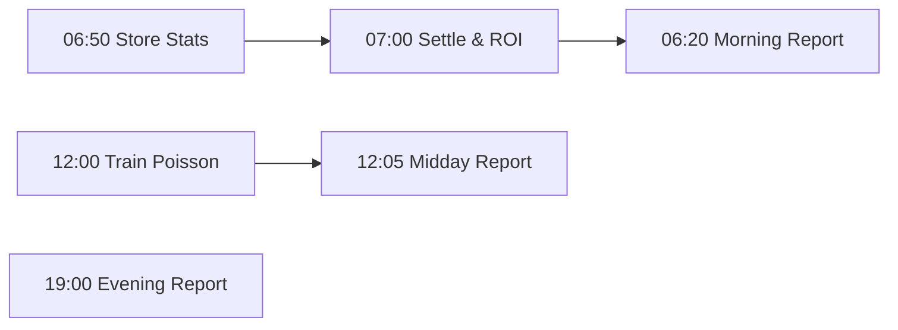

# 🏒 NHL Automation System

**Système automatisé de prédictions NHL avec modèle Poisson, bankroll tracking et rapports Discord.**

## 🎯 Fonctionnalités

- ✅ **Récupération automatique** des scores NHL (NHL Edge Stats API)
- ✅ **Modèle Poisson** pour prédictions et calcul de fair odds
- ✅ **Détection de value bets** avec edge % et confidence
- ✅ **Tracking bankroll & ROI** avec historique complet
- ✅ **Rapports automatiques** (matin/midi/soir) sur Discord
- ✅ **Settlement automatique** des picks avec calcul P&L
- ✅ **100% gratuit** (GitHub Actions + SQLite + Discord)

## 📦 Stack Technique

| Composant | Technologie | Pourquoi |
|-----------|-------------|----------|
| **Language** | Python 3.11+ | Scipy/Numpy pour modèle Poisson |
| **Base de données** | SQLite | Pas de serveur, fichier local, gratuit |
| **API NHL** | NHL Edge Stats API | API officielle, données complètes |
| **Notifications** | Discord Webhooks | Gratuit, simple, temps réel |
| **Automatisation** | GitHub Actions | 2000 min/mois gratuit, cron intégré |
| **ML/Stats** | Scipy + Numpy | Distributions de Poisson |

## 🚀 Installation

### 1. Clone le repository

```bash
git clone <your-repo-url>
cd hockey
```

### 2. Installer Python 3.11+

```bash
python3 --version  # Vérifier version >= 3.11
```

### 3. Installer les dépendances

```bash
pip install -r requirements.txt
```

### 4. Configuration

Copier le fichier d'exemple:

```bash
cp .env.example .env
```

Éditer `.env` avec vos paramètres:

```env
# Discord Webhooks (REQUIS)
DISCORD_WEBHOOK_URL=https://discord.com/api/webhooks/YOUR_ID/YOUR_TOKEN
DISCORD_ALERT_WEBHOOK_URL=https://discord.com/api/webhooks/ALERT_ID/ALERT_TOKEN

# Bankroll
INITIAL_BANKROLL=1000.0
DEFAULT_STAKE_PERCENTAGE=2.0

# Model
MIN_EDGE_PERCENTAGE=5.0
MIN_CONFIDENCE=6
MAX_PICKS_PER_REPORT=5
```

### 5. Créer un Discord Webhook

1. Aller sur votre serveur Discord
2. Paramètres du canal → Intégrations → Webhooks
3. Créer un webhook et copier l'URL
4. Coller l'URL dans `.env`

### 6. Initialiser la base de données

```bash
python database/migrations.py
```

## 🎮 Utilisation

### Tests locaux

#### 1. Récupérer les stats de matchs

```bash
python jobs/store_game_stats.py
```

#### 2. Entraîner le modèle Poisson

```bash
python jobs/train_poisson.py
```

#### 3. Générer un rapport

```bash
python jobs/generate_report.py morning
python jobs/generate_report.py midday
python jobs/generate_report.py evening
```

#### 4. Settlement et ROI

```bash
python jobs/settle_and_roi.py
```

### Déploiement automatique (GitHub Actions)

#### 1. Configurer les secrets GitHub

Aller sur votre repo → Settings → Secrets → Actions

Ajouter ces secrets:

- `DISCORD_WEBHOOK_URL`: URL de votre webhook Discord
- `DISCORD_ALERT_WEBHOOK_URL`: URL du webhook d'alertes (optionnel)

#### 2. Activer GitHub Actions

Le fichier `.github/workflows/nhl_automation.yml` est déjà configuré avec ces horaires (heure de Paris):

| Heure | Job | Description |
|-------|-----|-------------|
| 06:20 | Morning Report | Rapport matinal |
| 06:50 | Store Stats | Sauvegarde résultats J-1 |
| 07:00 | Settle & ROI | Settlement picks + bankroll |
| 12:00 | Train Poisson | Entraînement modèle |
| 12:05 | Midday Report | Rapport midi avec picks |
| 19:00 | Evening Report | Rapport soir |

#### 3. Lancer manuellement un job

Sur GitHub:
- Actions → NHL Automation System
- Run workflow → Choisir le job

## 📊 Architecture

```
hockey/
├── config/           # Configuration (API, paramètres)
├── database/         # SQLite models & migrations
├── nhl_api/         # Client NHL Edge Stats API
├── models/          # Modèle Poisson (scipy)
├── reports/         # Générateur de rapports
├── bankroll/        # Tracker bankroll & ROI
├── discord_bot/     # Intégration Discord webhooks
└── jobs/            # Scripts d'exécution (cron)
```

## 🗄️ Schéma Base de Données

### Tables principales

- **game_stats**: Résultats des matchs NHL
- **reports_nhl**: Rapports générés
- **reports_nhl_picks**: Picks avec edge, cotes, stake
- **model_predictions**: Paramètres modèle Poisson (λ)
- **bankroll_state**: État quotidien du bankroll

### Vue SQL

- **vw_roi_daily**: ROI quotidien calculé

## 🧠 Modèle Poisson

### Principe

Le modèle utilise la **distribution de Poisson** pour prédire les scores:

```python
P(X = k) = (λ^k * e^-λ) / k!
```

### Entraînement

1. Récupère les matchs des 30 derniers jours
2. Calcule λ_home = moyenne(buts_home) × 1.15 (home advantage)
3. Calcule λ_away = moyenne(buts_away)

### Prédictions

Pour chaque match:
- **Probabilité home win** / away win
- **Fair odds** = 1 / probabilité
- **Expected total** = λ_home + λ_away
- **Over/Under probabilities**

### Value Bets

```python
edge_% = (market_odds - fair_odds) / fair_odds × 100
```

Picks sélectionnés si:
- Edge ≥ 5%
- Confidence ≥ 6/10

## 📈 Exemple de Rapport

```markdown
# ☀️ NHL — Midday Report

## 🎯 Value Picks (3)

### 1. Boston Bruins ML
- Market: Moneyline
- Odds: 1.95
- Fair Odds: 1.75
- Edge: +11.4%
- Confidence: 8/10
- Stake: 20.00€

### 2. TOR vs MTL Over 5.5
- Market: Totals
- Odds: 2.10
- Fair Odds: 1.92
- Edge: +9.4%
- Confidence: 7/10
- Stake: 20.00€

## ⭐ Model Grade: 7.5/10
```

## 🔄 Workflow Quotidien



## 🛠️ Développement

### Tester l'API NHL

```bash
python nhl_api/client.py
```

### Tester le modèle Poisson

```bash
python models/poisson.py
```

### Tester Discord

```bash
python discord_bot/webhook.py
```

## 📝 Configuration Avancée

### Paramètres du modèle

Éditer `config/config.py`:

```python
LOOKBACK_DAYS = 30              # Jours d'historique
HOME_ADVANTAGE_FACTOR = 1.15    # Avantage domicile (15%)
MIN_EDGE_PERCENTAGE = 5.0       # Edge minimum (%)
MIN_CONFIDENCE = 6              # Confidence minimum (/10)
```

### Personnaliser les horaires

Éditer `.github/workflows/nhl_automation.yml`:

```yaml
- cron: '0 11 * * *'  # Format: minute heure jour mois jour_semaine
```

## 🐛 Dépannage

### La base de données n'existe pas

```bash
python database/migrations.py
```

### Erreur "No module named X"

```bash
pip install -r requirements.txt
```

### Discord webhook ne fonctionne pas

Vérifier que l'URL est bien configurée dans `.env`:

```bash
echo $DISCORD_WEBHOOK_URL
```

### Pas de matchs trouvés

Normal si aucun match hier/aujourd'hui. NHL a des jours de pause.

## 🚦 Roadmap

### v1.0 (Actuel) ✅
- [x] Récupération scores NHL
- [x] Modèle Poisson v1
- [x] Rapports automatiques
- [x] Bankroll & ROI tracking
- [x] Discord integration
- [x] GitHub Actions automation

### v2.0 (Prochain) 🔜
- [ ] Intégration cotes réelles (Winamax/Betclic API)
- [ ] Modèle pondéré (forme récente, goalies, HFA)
- [ ] Stats avancées (xG, Corsi, Fenwick)
- [ ] Filtres de sécurité (variance, Kelly criterion)
- [ ] Dashboard web (Flask + Charts.js)

## 📄 Licence

MIT License - Libre d'utilisation

## 🤝 Support

Pour toute question:
1. Ouvrir une issue sur GitHub
2. Consulter la documentation NHL API: https://api-web.nhle.com/

---

**Fait avec ❤️ pour la communauté NHL betting**
